<picture>
  <source media="(prefers-color-scheme: dark)" srcset="assets/banner-dark.svg">
  
</picture>

### Where machine learning, software engineering and computer graphics meet

I'm an R&D Engineer building tools and systems that bring machine learning, software engineering and computer graphics together. I like work that is visual, a bit messy at the start, and useful by the end.

### Right now

- **Open source.** Contributing to [OpenEXR](https://github.com/AcademySoftwareFoundation/openexr) and [Imath](https://github.com/AcademySoftwareFoundation/Imath), the open-source image format and math library from the Academy Software Foundation. My work is mostly on the Python side: bindings, buffers and packaging.
- **Robots, for fun.** Building [microduck_academy](https://github.com/mshooter/microduck_academy), a MuJoCo simulation for the Microduck robot and groundwork for a [JdeRobot](https://github.com/JdeRobot/RoboticsInfrastructure/issues/807) Robotics Academy exercise.

### Where I come from

I did a Ph.D. in Vision, Speech and Signal Processing at the University of Surrey, teaching computers to read a dog's 3D pose from a single photo using synthetic data from game engines. Before that, an M.Sc. in Computer Vision, Robotics and Machine Learning at Surrey, and a B.Sc. in Software Development for Animation, Games and Effects at Bournemouth University.

### What I care about

<picture>
  <source media="(prefers-color-scheme: dark)" srcset="assets/interests-dark.svg">
  
</picture>

### Say hello

I'm always happy to talk about graphics, vision, tooling, robotics, or a good hiking trail. Find me on [LinkedIn](https://www.linkedin.com/in/moira-shooter-301107150) or through my [website](https://mshooter.github.io). My work-related open source lives on [@mshooter-ilm](https://github.com/mshooter-ilm).

The views on this page are my own.
